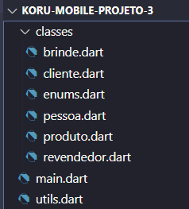

# App para controle de compra e venda

A empresa O Boticário deseja automatizar o controle de compra e venda de seus produtos, fornecendo aos clientes e revendedores um resumo de suas compras e vendas realizadas, bem como valores gastos e ganhos.\
O time de tecnologia DartMode foi escalado para criar esse sistema, que será montado por meio de classes que simulam as entidades do mundo real. 
## Screenshot arquivos

## Funcionalidades
 
- Realizar Vendas
- Ver Receita Gerada
- Calcular Idade e Maioridade (cliente)
- Adicionar Dinheiro (cliente)
- Comprar Produtos (cliente)
- Calcular Total Gasto (cliente)
- Calcular Media Produtos Comprados (cliente)
- Ordenar e ver Produtos Comprados (cliente)
- Vender Produto (revendedor)
- Calcular Total Vendido (revendedor)
- Calcular Media dos Produtos Vendidos (revendedor)
- Calcular Lucro (revendedor)

#### **EXTRAS:**
- Termometro Do Humor (cliente) 
- Sistema de Brindes Por Meio De Pontos
- Consultar Pontos Necessários Para Cada Brinde
- Realizar Troca de Pontos Por Brindes

## Aprendizados

Programação orientada a objetos (POO), lógica de programação, git e github, trabalho em equipe, code review, criação de branchs, scrum na prática (organização utilizando trello), criação e instanciação de classes e construtores, atributos e métodos,  utilização de operadores, declaração de variáveis, comites semânticos e tratamento de erros e excessões.

## Stack utilizada

- **Dart**

## Autores

|  |  |  | 
|:---:|:---:|
| **Dayane** | **Everton** | **Fábio** | **Jair** |
|  |  | | 
| **Marcos** | **Matheus** | **Wellington** | **Wilmar** |
